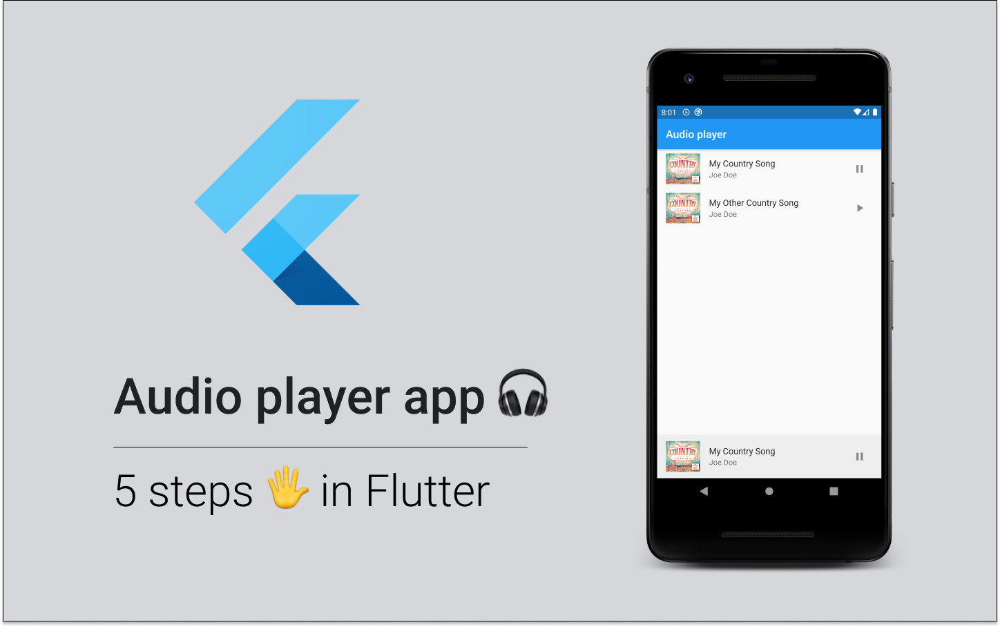

# Flutter - Audio Player app

It's a Flutter application that provides a basic audio player functionality, using [Assets Audio Players](https://pub.dev/packages/assets_audio_player) plugin.

It's an example for [5 steps for building audio player in Flutter](https://arekbiela.com/flutter-5-steps-audio-player/) article.

## Contributions

The codebase cannot be treated as completed, as it's just an example. Chances are, you'll need to expand and improve it in your codebase. However, if you find something worth sharing to everyone who would make use of that code, feel free to [create a Pull Request](../../pulls)!

